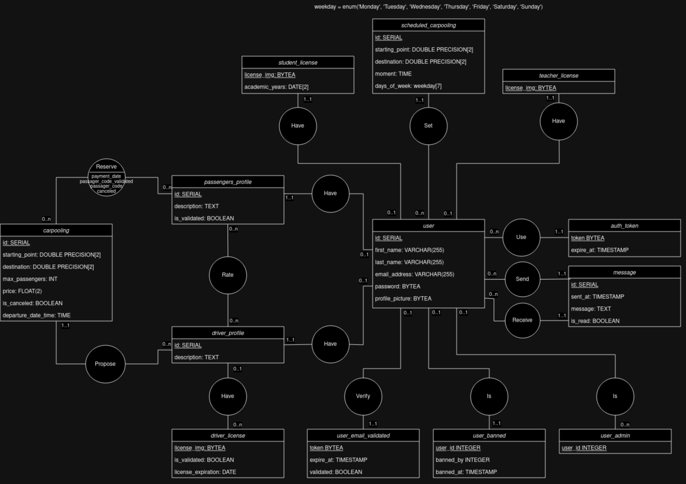
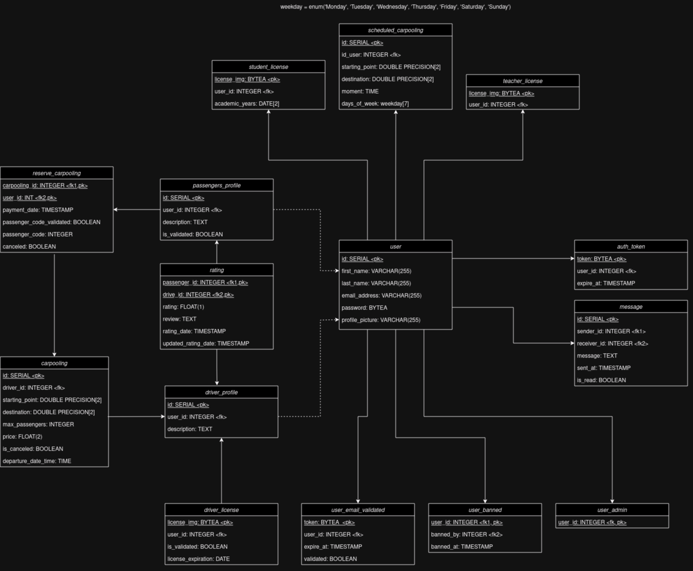

# Base de données du projet CARMATE
## Table des matières
- [**MCD**](#mcd)
- [**MLD**](#mld)
- [**Les variable d'environment**](#les-variables-denvironment)
- [**Lancer l'image Docker depuis votre machine**](#lancer-limage-docker-depuis-votre-machine)
- [**Se connecter à `postgres`**](#se-connecter-à-postgres)

## MCD

## MLD

